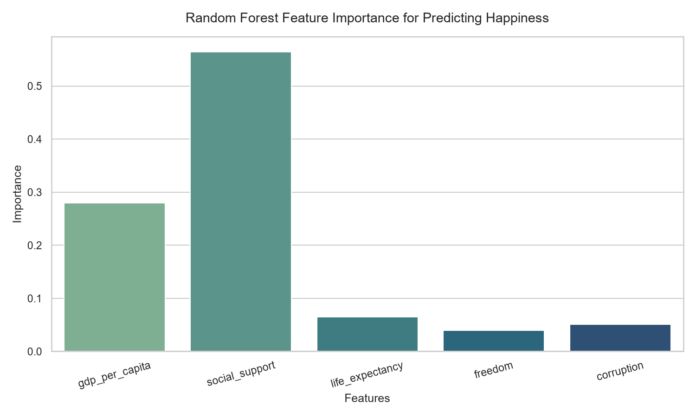
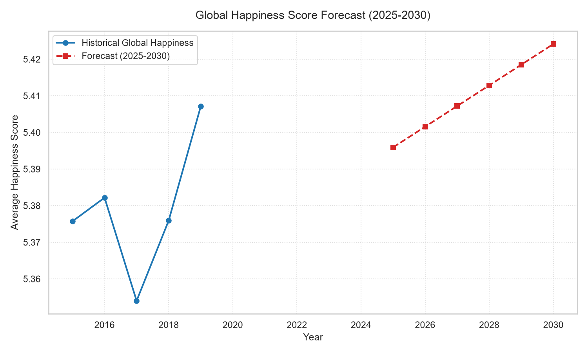
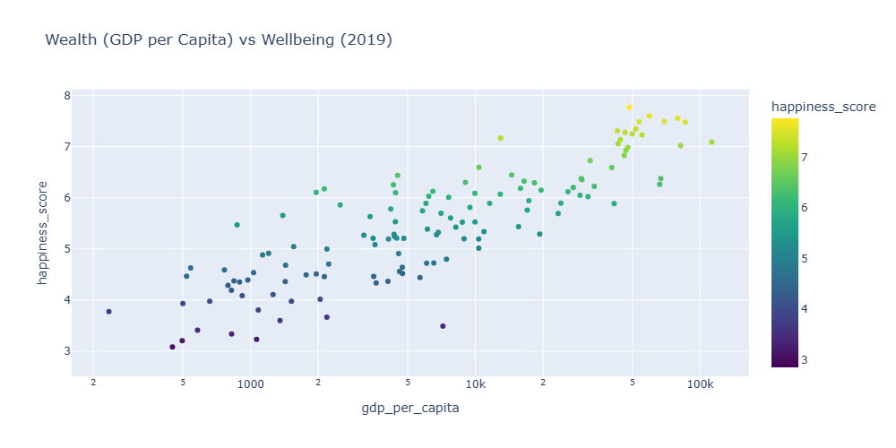
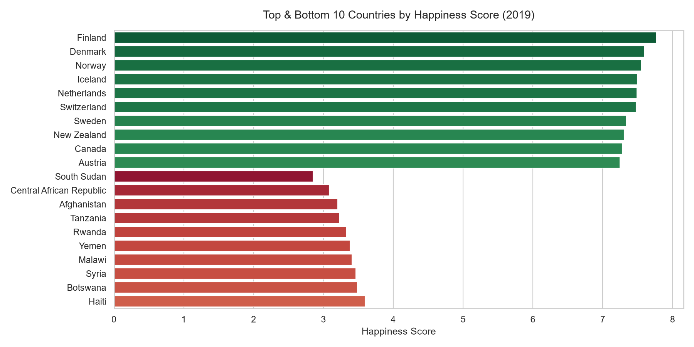
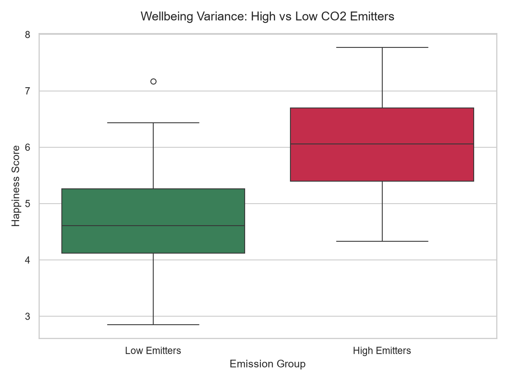

# Global Climate & Socioeconomic Impact Analysis

## Overview
This project investigates the complex relationships between global economic indicators, social wellbeing (happiness), and environmental factors. By combining data from the World Bank, Our World in Data (OWID), and the World Happiness Report (WHR), we aim to uncover how economic growth and climate metrics impact subjective wellbeing globally.

## Architecture & Technology Stack
The project relies on a modern, high-performance local data stack:
* **DuckDB**: For ultra-fast analytical queries and data warehousing.
* **Polars**: For lightning-fast DataFrame manipulation and data wrangling.
* **Jupyter Notebook**: The unified presentation and analysis layer.
* **Plotly**: For interactive visualizations (Choropleth maps, scatter plots).
* **Scikit-Learn & Statsmodels**: For advanced statistical analysis, clustering (K-Means), PCA, and non-linear modeling (Random Forest).
* **uv**: For strict, reproducible Python environment and dependency management.

## Project Structure
* `data/`: Contains raw CSVs and the unified `climate_wellbeing.duckdb` database.
* `analyses/`: Contains the master Jupyter Notebook (`Climate_Economic_Wellbeing_Analysis.ipynb`) and data ingestion scripts.
* `generate_notebook.py`: Python script used to programmatically generate the notebook with the correct structure and cells.

## Key Insights

### 1. The Power of Social Support & GDP
Based on our OLS Panel Regression and Random Forest models, **Social Support** and **GDP per capita** emerged as the strongest predictors of a country's happiness score. 



```text
                            OLS Regression Results                            
==============================================================================
Dep. Variable:        happiness_score   R-squared:                       0.801
Model:                            OLS   Adj. R-squared:                  0.793
...
===================================================================================
                      coef    std err          t      P>|t|      [0.025      0.975]
-----------------------------------------------------------------------------------
const               2.1750      0.232      9.361      0.000       1.715       2.635
gdp_per_capita   1.611e-05   3.54e-06      4.555      0.000    9.11e-06    2.31e-05
social_support      1.2492      0.236      5.291      0.000       0.782       1.717
life_expectancy     1.4319      0.325      4.407      0.000       0.789       2.075
freedom             1.2115      0.402      3.012      0.003       0.415       2.008
corruption         -0.2652      0.660     -0.402      0.689      -1.572       1.042
===================================================================================
```

### 2. Time-Series Forecasting (Holt's Linear Trend)
We used exponential smoothing to project the global average happiness score for the next 6 years (2025-2030), demonstrating systemic global stability despite upcoming climate and economic shifts.

**Global Happiness Score Forecast (2025-2030):**


### 3. Global Clustering & Spatial Distribution
Using K-Means and PCA, countries naturally grouped into distinct profiles based on economic stability, perceived corruption, and social support.

**Wealth vs Wellbeing Scatter Analysis:**


**Global Distribution Map:**


### 4. Deep Dive: Climate & COVID-19 Resilience
* **COVID-19 Resilience:** Statistical T-Tests between Pre-COVID (2015-2019) and Post-COVID (2020-2024) periods reveal no significant global collapse in happiness, showcasing societal resilience.
* **The CO2 Paradox:** Countries with high CO2 emissions per capita tend to report significantly higher happiness scores. This paradox highlights the deep entwinement of industrial wealth and societal wellbeing, proving that economic benefits currently outweigh the perceived penalties of high emissions in developing metrics.

**Wellbeing Variance: High vs Low CO2 Emitters:**


## Sample Data (fct_climate_economy)
|    | country_name   |   year | iso_code   |   happiness_score |   happiness_rank |   social_support |   life_expectancy |   freedom |   corruption |   generosity |   gdp_per_capita |
|---:|:---------------|-------:|:-----------|------------------:|-----------------:|-----------------:|------------------:|----------:|-------------:|-------------:|-----------------:|
|  0 | Argentina      |   2015 | AR         |             6.574 |               30 |          1.24823 |          0.78723  |  0.44974  |    0.08484   |     0.11451  |         13679.6  |
|  1 | Australia      |   2017 | AU         |             7.284 |               10 |          1.51004 |          0.843887 |  0.601607 |    0.301184  |     0.477699 |         54117.5  |
|  2 | Bahrain        |   2019 | BH         |             6.199 |               37 |          1.368   |          0.871    |  0.536    |    0.11      |     0.255    |         27259.7  |
|  3 | Benin          |   2018 | BJ         |             4.141 |              136 |          0.372   |          0.24     |  0.44     |    0.067     |     0.163    |          1151.74 |

## How to Run the Analysis
1. Ensure `uv` is installed on your system.
2. Navigate to the project root and start the Jupyter environment:
   ```bash
   uv run jupyter notebook
   ```
3. Open `analyses/Climate_Economic_Wellbeing_Analysis.ipynb` and click **Run All Cells**.

## How to Run the Interactive Dashboard
To explore the data interactively through our premium Streamlit web application:
```bash
uv run streamlit run dashboard/app.py
```
This will launch the dashboard locally in your default web browser.
