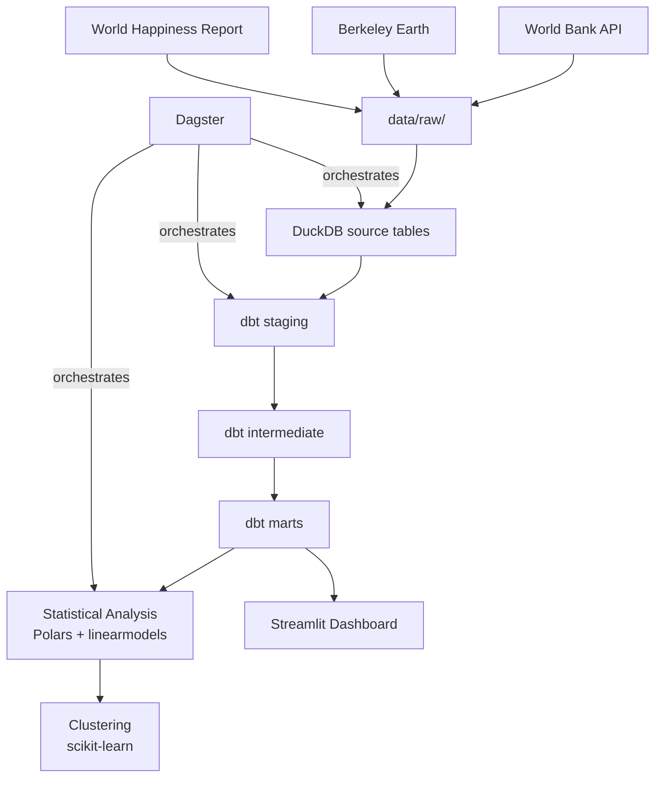

# Climate Change & Global Economic-Social Wellbeing
## Cross-Impact Analysis

> **Status:** 🚧 Active Development — Phase 1 (Data Source Validation) in progress.

---

## Abstract

This project investigates the relationship between climate variables (temperature anomaly, CO2 emissions) and country-level economic indicators (GDP per capita, Gini coefficient) and social wellbeing (World Happiness Report scores) using panel data econometrics. Countries are clustered into similar risk/wellbeing profiles using unsupervised learning. All correlational findings are clearly distinguished from causal claims; Granger causality tests are used to discuss potential causal directions.

---

## Problem Statement & Motivation

Climate change is increasingly recognized as a threat multiplier affecting economic output, inequality, and human wellbeing. Yet rigorous, reproducible, country-year panel analyses that simultaneously integrate climate, economic, and wellbeing data remain scarce in open-source form. This project builds a production-grade analytics pipeline to explore these cross-domain relationships transparently.

**Out of scope:** real-time streaming, sub-national analysis, and definitive causal claims.

---

## Quick Start

```bash
git clone https://github.com/Bor-Code/Global-Climate-Socioeconomic-Impact.git
cd Global-Climate-Socioeconomic-Impact

cp .env.example .env

uv venv && uv pip install -e ".[dev]"

pre-commit install

docker-compose -f docker/docker-compose.yml up --build
```

---

## Architecture



---

## Data Sources

| Source | Provider | Granularity | Key Variables |
|--------|----------|-------------|---------------|
| Climate | Berkeley Earth / World Bank | Country-Year | Temperature anomaly, CO2 emissions |
| Economy | World Bank Open Data API | Country-Year | GDP per capita, Gini index, unemployment |
| Wellbeing | World Happiness Report (Gallup) | Country-Year | Happiness score and sub-components |

**Common analysis window:** 2005–2022 (determined by WHR availability)

---

## Tech Stack

| Layer | Tool | Rationale |
|-------|------|-----------|
| Storage | DuckDB | Serverless OLAP, native dbt integration |
| Transformation | dbt-core + dbt-duckdb | Real DAG lineage, dbt test, dbt docs |
| Processing | Polars | Modern, fast, single-machine sufficient |
| Statistics | statsmodels + linearmodels | Panel fixed-effects, not plain OLS |
| Clustering | scikit-learn | KMeans with StandardScaler + PCA |
| Orchestration | Dagster | dbt-native integration, modern alternative to Airflow |
| Dashboard | Streamlit | Interactive product, not a notebook |
| CI/CD | GitHub Actions | Automated lint + test + dbt test on push |
| Dependency | uv | Lock-file guaranteed, 10-100x faster than pip |

---

## Statistical Methodology

- **Panel Regression:** `linearmodels.PanelOLS` with country fixed effects to control for time-invariant unobserved heterogeneity
- **VIF Check:** Variance inflation factor computed for all regressors
- **Train-Test Split:** Temporal (not random) — e.g. 2005–2018 train / 2019–2022 test
- **Causality:** Granger causality tests with lag structures (t-1, t-5); correlation ≠ causation is explicitly stated throughout
- **Clustering:** StandardScaler → Elbow + Silhouette → KMeans → optional PCA visualization
- **Reproducibility:** `RANDOM_SEED=42` fixed globally

---

## Limitations & Threats to Validity

- Correlation is not causation. No causal claims are made.
- Missing data for lower-income countries may introduce selection bias.
- World Happiness Report relies on self-reported survey data (Gallup).
- Analysis window limited to 2005–2022 by WHR availability.
- Country-level aggregation masks within-country heterogeneity.

---

## Project Structure

```
├── .github/workflows/     CI/CD pipeline
├── docker/                Dockerfile, docker-compose.yml
├── data/
│   ├── raw/               Immutable, date-stamped raw data
│   └── external/          Crosswalk / manual override tables
├── dbt_project/
│   ├── models/staging/    stg_climate, stg_worldbank, stg_happiness, stg_country_mapping
│   ├── models/intermediate/ int_country_year_joined
│   └── models/marts/      fct_climate_economy, dim_country
├── analyses/src/          Python: data_processing, modeling, clustering
├── orchestration/         Dagster definitions
├── dashboard/             Streamlit app
├── tests/                 pytest unit tests
└── docs/                  Methodology notes, architecture diagrams
```

---

## How to Reproduce

```bash
docker-compose -f docker/docker-compose.yml up --build
```

All services start automatically: Dagster orchestrator (port 3000), Streamlit dashboard (port 8501).

---

## License

MIT — see [LICENSE](LICENSE)
