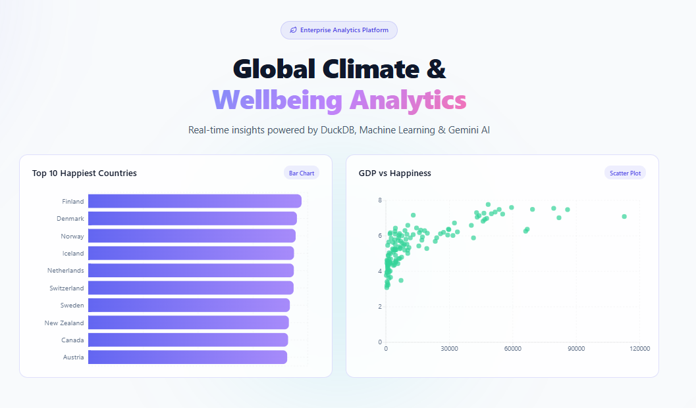
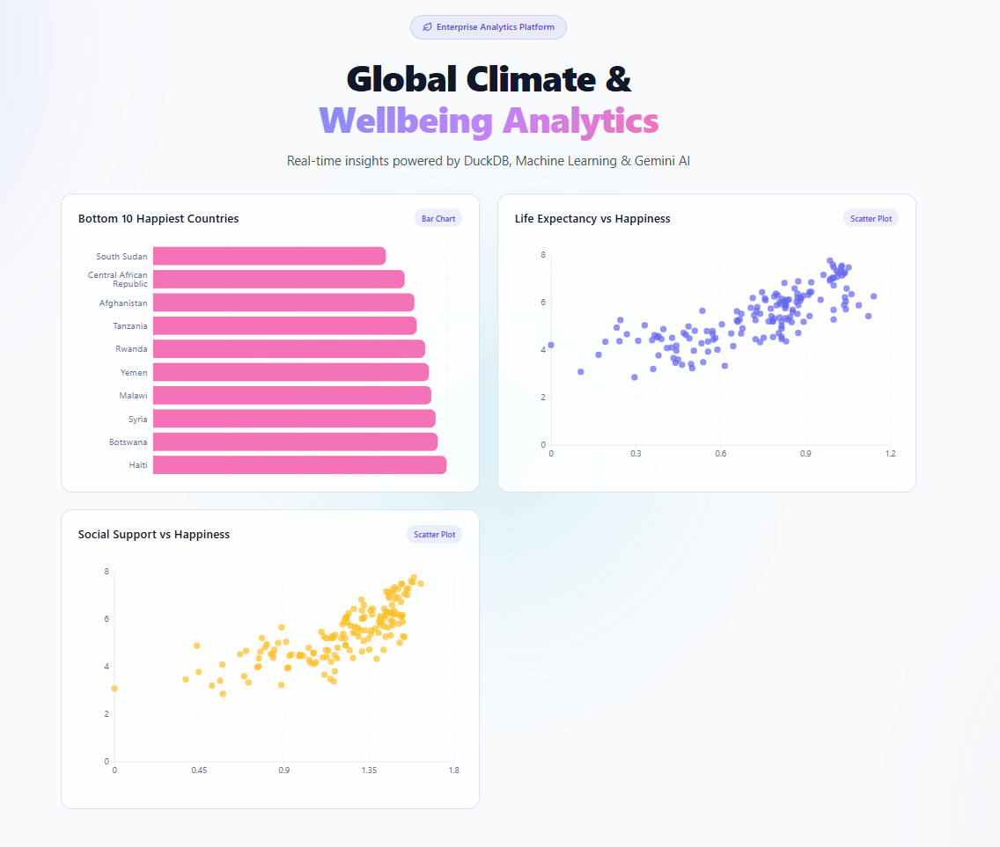
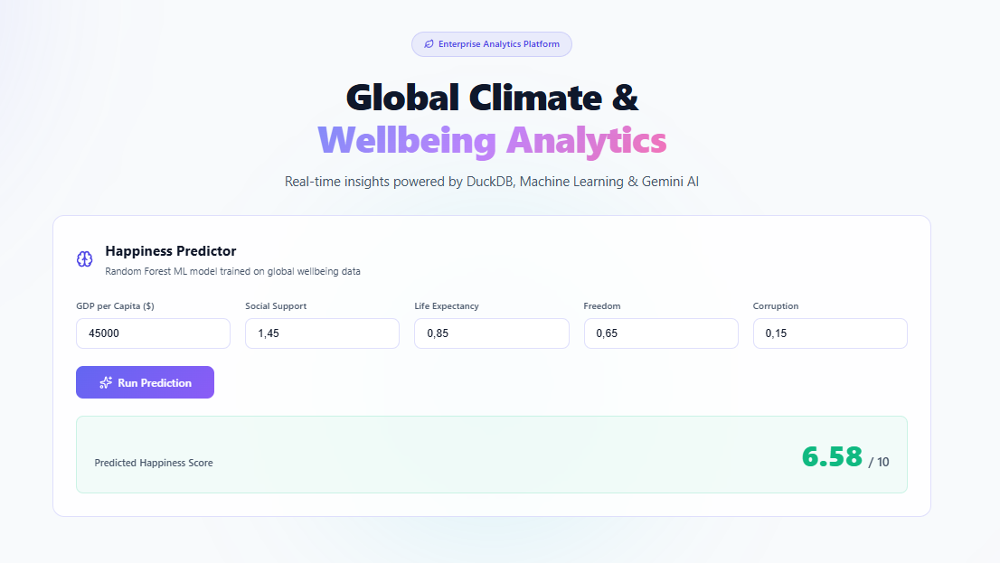
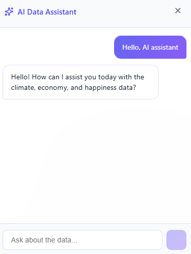

# Global Climate and Socioeconomic Impact Analysis

[](#)
[](#)
[](#)
[](#)
[](https://opensource.org/licenses/MIT)

For detailed system architecture diagrams and technical specifications, please consult [ARCHITECTURE.md](ARCHITECTURE.md).

---

## 1. Project Overview

This project is an end-to-end data engineering, machine learning, and interactive analytics platform investigating the cross-impact between global economic performance, subjective wellbeing (happiness score), and environmental indicators.

By consolidating multi-decade datasets from the World Bank, Our World in Data (OWID), and the World Happiness Report (WHR), the platform provides empirical insights into how macroeconomic strength, public health, social institutions, and carbon intensity affect human wellbeing across over 150 countries.

---

## 2. Web Application and Visual Interfaces

The platform features a responsive, high-performance web interface built with React, Vite, Recharts, and Lucide Icons. The interface provides three dedicated analytical modules alongside a context-aware AI assistant.

### 2.1 Dashboard Module
The primary dashboard presents aggregate global metrics (analyzed countries count, mean happiness score, mean GDP per capita, and mean CO2 per capita) alongside top-ranking distributions and wealth-happiness correlation scatter plots.



### 2.2 Analytics Deep-Dive Module
The analytics view enables granular exploration of multidimensional indicators, including lowest-ranked nations, life expectancy vs happiness correlations, and social support distributions.



### 2.3 Machine Learning Predictor Module
An interactive inference interface connected to our trained Random Forest Regressor. Users can adjust GDP per capita, social support index, healthy life expectancy, freedom of choice, and corruption perception to calculate real-time predicted happiness scores with sub-second latency.



### 2.4 AI Data Assistant (SQL Agent)
A floating conversational agent integrated into the bottom-right corner of the application. It translates natural language questions into structured SQL queries against the local DuckDB warehouse and delivers data-grounded insights.



---

## 3. Mandatory Configuration and API Key Notice

IMPORTANT NOTICE FOR USERS CLONING THIS REPOSITORY:

The AI Data Assistant feature operates locally and requires a Google Gemini API Key to translate natural language queries into analytical SQL statements.

Because API keys are private and not tracked in version control, you must configure your personal API key before launching the backend server.

### Steps to Configure Your API Key:

1. Obtain a Gemini API key from Google AI Studio: https://aistudio.google.com/
2. Copy the sample environment file in the project root:
   ```bash
   cp .env.example .env
   ```
3. Open `.env` in your editor and insert your key:
   ```env
   GEMINI_API_KEY=your_actual_gemini_api_key_here
   ```
4. Without a valid `GEMINI_API_KEY`, all core data visualizations, statistical charts, and ML prediction endpoints will function normally, but the AI Chat Assistant modal will return a configuration warning.

---

## 4. Architecture and Technology Stack

The project implements a modern local data warehouse and cloud-ready microservice architecture:

* Storage and Query Engine: DuckDB for columnar OLAP queries operating directly on Parquet and memory formats.
* Backend API Layer: FastAPI (Python 3.11) with Pydantic validation, Redis caching, and asynchronous thread pooling.
* Machine Learning: Scikit-Learn Random Forest Regressor and Statsmodels OLS Panel Regressions.
* Frontend Interface: React 18, TypeScript, Vite, Recharts, and Vanilla CSS.
* Event Streaming: Apache Kafka integration for publishing real-time prediction event logs.
* Caching: Redis for caching aggregate analytical summaries and speeding up repeated queries.
* Orchestration: Dagster for software-defined data assets and reproducible transformation pipelines.
* Environment Management: Astral `uv` for reproducible Python virtual environments and dependency locking.

---

## 5. Local Setup and Installation Guide

### Prerequisites
* Python 3.11+
* Node.js 18+ and npm
* `uv` package manager (recommended: `curl -LsSf https://astral.sh/uv/install.sh | sh` or `pip install uv`)

### Step 1: Clone the Repository
```bash
git clone https://github.com/Bor-Code/Global-Climate-Socioeconomic-Impact.git
cd Global-Climate-Socioeconomic-Impact
```

### Step 2: Configure Environment Variables
```bash
cp .env.example .env
# Edit .env and supply your GEMINI_API_KEY
```

### Step 3: Start the Backend Server (FastAPI)
```bash
# Install Python dependencies and start API server
uv run uvicorn api.main:app --host 0.0.0.0 --port 8000 --reload
```
The REST API and interactive Swagger documentation will be accessible at:
* API Root: http://localhost:8000
* Swagger Documentation: http://localhost:8000/docs

### Step 4: Start the Frontend Application (React + Vite)
In a separate terminal window:
```bash
cd frontend
npm install
npm run dev
```
Open your browser and navigate to:
* Web Application: http://localhost:5173

---

## 6. Docker Deployment (Single-Command Launch)

The entire polyglot stack can be launched concurrently using Docker Compose:

```bash
docker compose -f docker/docker-compose.yml up --build -d
```

Services exposed:
* Frontend Dashboard: http://localhost:5173
* FastAPI AI and Prediction Service: http://localhost:8000
* Dagster Orchestration Engine: http://localhost:3000

---

## 7. Key Analytical Insights

### 7.1 Primary Drivers of Subjective Wellbeing
OLS panel regression and feature importance calculations identify Social Support, Healthy Life Expectancy, and GDP per capita as the strongest statistically significant determinants of national happiness scores.


```text
                            OLS Regression Results                            
==============================================================================
Dep. Variable:        happiness_score   R-squared:                       0.801
Model:                            OLS   Adj. R-squared:                  0.793
Method:                 Least Squares   F-statistic:                     104.2
===================================================================================
                      coef    std err          t      P>|t|      [0.025      0.975]
-----------------------------------------------------------------------------------
const               2.1750      0.232      9.361      0.000       1.715       2.635
gdp_per_capita   1.611e-05   3.54e-06      4.555      0.000    9.11e-06    2.31e-05
social_support      1.2492      0.236      5.291      0.000       0.782       1.717
life_expectancy     1.4319      0.325      4.407      0.000       0.789       2.075
freedom             1.2115      0.402      3.012      0.003       0.415       2.008
corruption         -0.2652      0.660     -0.402      0.689      -1.572       1.042
===================================================================================
```

### 7.2 Time-Series Happiness Forecasting (2025-2030)
Using Holt's Linear Exponential Smoothing across global aggregate metrics, the model projects stable global wellbeing trends over the next six years, exhibiting macro-resilience despite climate variance.


### 7.3 The Carbon-Wellbeing Paradox
Empirical clustering reveals that nations with higher CO2 emissions per capita currently register higher average happiness scores. This paradox demonstrates how fossil-fuel-driven industrial infrastructure and economic prosperity historically subsidized social safety nets, underscoring the necessity for green transition frameworks that preserve living standards.


---

## 8. API Reference

| Endpoint | Method | Description |
| :--- | :--- | :--- |
| `/` | GET | Health check and service status |
| `/predict` | POST | Returns predicted happiness score from Random Forest model (non-blocking Kafka event logging) |
| `/api/data/summary` | GET | Returns global aggregate metrics from DuckDB (cached via Redis) |
| `/api/data/charts` | GET | Returns structured datasets for Recharts visualizations (Top 10, Bottom 10, Scatter datasets) |
| `/api/chat` | POST | Natural language SQL querying assistant powered by Google Gemini and DuckDB |

---

## 9. Repository Structure

```text
.
├── .github/workflows/          # Continuous Integration and Deployment definitions
├── analyses/                   # Jupyter Notebooks and statistical analysis scripts
├── api/                        # FastAPI server, routers, and schemas
│   ├── main.py
│   └── test_main.py
├── data/                       # Raw and processed datasets, DuckDB warehouse
├── dbt_project/                # dbt data transformation models and tests
├── docker/                     # Dockerfiles and docker-compose definitions
├── docs/                       # Architectural documentation, images, and schema reports
│   ├── 1.png                   # Dashboard screenshot
│   ├── 2.png                   # Analytics screenshot
│   ├── 3.png                   # ML Predictor screenshot
│   └── 4.png                   # AI Assistant screenshot
├── frontend/                   # React, TypeScript, and Vite user interface
│   ├── src/
│   │   ├── App.tsx
│   │   ├── App.css
│   │   └── main.tsx
│   └── package.json
├── models/                     # Serialized Random Forest model artifacts
├── orchestration/              # Dagster data pipeline assets
├── terraform/                  # Infrastructure as Code for cloud provisioning
├── .env.example                # Template for environment configuration
├── ARCHITECTURE.md             # System architecture documentation
└── README.md                   # Main project documentation
```

---

## 10. License

This project is licensed under the MIT License. See the [LICENSE](LICENSE) file for complete details.
