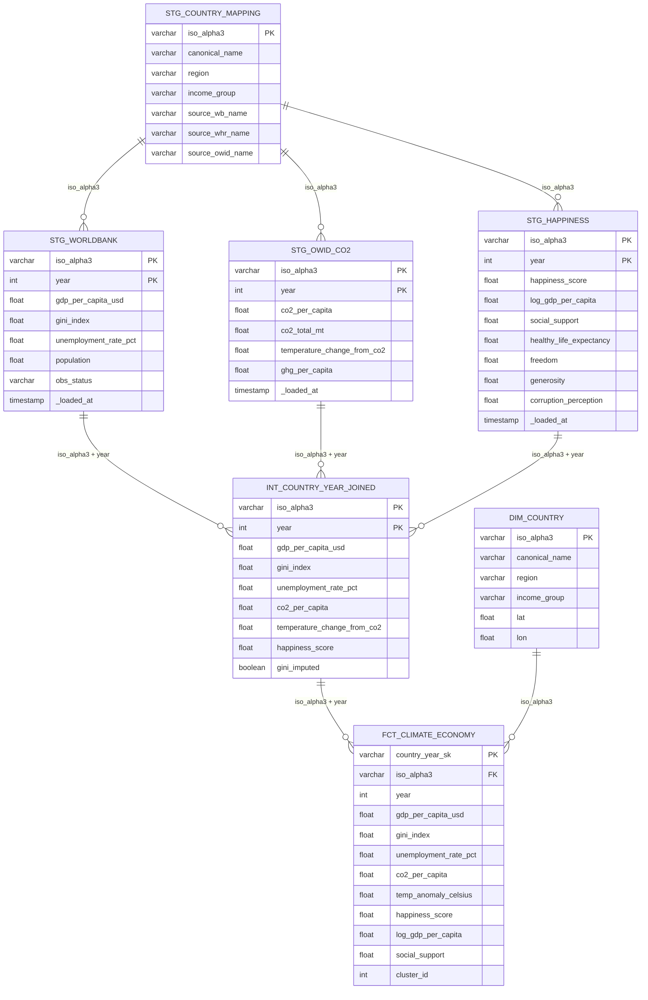

# Phase 1 — Data Source Schema Validation Report

**Generated:** 2026-08-26 | **Analysis Window:** 2005–2022 (18 years)

---

## Source Decision Summary

| Source | Status | Decision |
|--------|--------|----------|
| World Bank API | Accessible | Primary source for GDP, Gini, unemployment, population |
| OWID CO2 Dataset | Accessible | Primary source for CO2 (replaces WB EN.ATM.CO2E.PC — inactive) |
| Berkeley Earth S3 | Accessible | Primary source for temperature anomaly |
| World Happiness Report | Official site accessible, direct CSV requires manual download | Downloaded as static file to `data/raw/` |

---

## World Bank API — Confirmed Schema

**Endpoint:** `https://api.worldbank.org/v2/country/{iso3}/indicator/{code}?format=json`

**Raw response fields per record:**

| Field | Type | Notes |
|-------|------|-------|
| `indicator.id` | string | WB indicator code (e.g. `NY.GDP.PCAP.CD`) |
| `indicator.value` | string | Human-readable indicator name |
| `country.id` | string | 2-letter ISO code (unreliable) |
| `country.value` | string | Country name (inconsistent spelling — crosswalk required) |
| `countryiso3code` | string | **ISO 3166-1 alpha-3 — join key** |
| `date` | string | Year as string (e.g. `"2022"`) |
| `value` | float/null | Indicator value; null when not reported |
| `unit` | string | Usually empty |
| `obs_status` | string | Observation status flag |
| `decimal` | int | Decimal places for display |

**Indicators confirmed active (2000–2023, 6360 total records each):**

| Code | Name | Coverage Notes |
|------|------|----------------|
| `NY.GDP.PCAP.CD` | GDP per capita (current USD) | Good coverage, some gaps for conflict countries |
| `SI.POV.GINI` | Gini index | Sparse — many country-years null, imputation needed |
| `SL.UEM.TOTL.ZS` | Unemployment rate (%) | Reasonable coverage |
| `EN.CLC.MDAT.ZS` | Climate-related indicator (WB) | Sparse, secondary use |
| `SP.POP.TOTL` | Total population | Full coverage |
| `EN.ATM.CO2E.PC` | CO2 per capita | **INACTIVE** — replaced by OWID |

---

## Our World in Data CO2 — Confirmed Schema

**URL:** `https://raw.githubusercontent.com/owid/co2-data/master/owid-co2-data.csv`
**Total columns:** 79

**Key columns selected for this project:**

| Column | Type | Description |
|--------|------|-------------|
| `country` | string | Country name (needs crosswalk) |
| `year` | int | Year |
| `iso_code` | string | ISO 3166-1 alpha-3 (join key; missing for aggregates) |
| `co2` | float | Total CO2 (million tonnes) |
| `co2_per_capita` | float | CO2 per capita (tonnes) |
| `co2_growth_prct` | float | Year-on-year % change |
| `temperature_change_from_co2` | float | Temperature change attributed to CO2 (C) |
| `total_ghg` | float | Total greenhouse gas emissions |
| `ghg_per_capita` | float | GHG per capita |
| `primary_energy_consumption` | float | TWh |
| `population` | float | Cross-check with WB |

**Coverage:** 1750–2022; rows where `iso_code` is null are global/regional aggregates — excluded.

---

## World Happiness Report — Expected Schema

**Source:** Annual Excel/CSV files from worldhappiness.report (2005–2023)
**Download strategy:** Static files ingested to `data/raw/` with date-stamps

| Column | Type | Description |
|--------|------|-------------|
| `Country name` | string | Needs crosswalk |
| `year` | int | Survey year |
| `Life Ladder` | float | Happiness score (Cantril scale 0–10) |
| `Log GDP per capita` | float | Log of GDP per capita (PPP) |
| `Social support` | float | 0–1 scale |
| `Healthy life expectancy at birth` | float | Years |
| `Freedom to make life choices` | float | 0–1 scale |
| `Generosity` | float | Residual after regressing on log GDP |
| `Perceptions of corruption` | float | 0–1 scale (lower = more corrupt) |
| `Positive affect` | float | |
| `Negative affect` | float | |

**Coverage:** ~150 countries, 2005–2022 (some countries missing early years)

---

## Berkeley Earth — Temperature Anomaly

**Accessible URL:** `https://berkeley-earth-temperature.s3.amazonaws.com/Global/Land_and_Ocean_summary.txt`
**Country-level files:** `https://berkeley-earth-temperature.s3.amazonaws.com/countries/TAVG/Text/{country_name}-TAVG-Trend.txt`

**Format:** Fixed-width text with header metadata
**Key fields extracted:** `year`, `month`, `anomaly`, `uncertainty`
**Aggregation needed:** Monthly → Annual mean anomaly per country

**Decision:** Berkeley Earth provides country-level annual temperature anomaly. Files will be downloaded per-country in Phase 2.

---

## Coverage Comparison (Estimated, 2005–2022)

| Dataset | Countries | Year Range | Completeness |
|---------|-----------|------------|--------------|
| World Bank GDP | ~215 sovereign states | 2000–2023 | ~85% (gaps in conflict zones) |
| World Bank Gini | ~170 | 2000–2023 | ~40% (very sparse) |
| OWID CO2 | ~230 | 1750–2022 | ~90% for 2005–2022 |
| WHR | ~150 | 2005–2022 | ~80% (some countries in few years only) |
| Berkeley Earth | ~100+ | 1750–2022 | ~90% for major countries |

**Expected panel after inner join (all 4 sources):** ~120–140 countries, 2005–2022

---

## Data Quality Issues Identified

| Issue | Severity | Mitigation |
|-------|----------|------------|
| Gini very sparse | High | Forward-fill within country, flag as imputed |
| WHR missing early years for some countries | Medium | Country-year panel is unbalanced — use linearmodels unbalanced panel support |
| Berkeley Earth monthly → annual aggregation | Low | Mean of monthly anomalies |
| Country name inconsistencies across 3 sources | High | `stg_country_mapping` dbt model + `country_overrides.csv` |
| OWID aggregates (World, Continent rows) | Medium | Filter `iso_code IS NOT NULL AND LENGTH(iso_code) = 3` |
| WB includes non-sovereign regions | Medium | Filter to sovereign countries via `region != 'Aggregates'` |

---

## Missing Data Strategy Decision

| Variable | Strategy | Justification |
|----------|----------|---------------|
| Gini index | Forward-fill (max 3 years) within country | Gini changes slowly; >3y gap → drop |
| WHR sub-scores | Keep NaN — not used as regressors | Happiness score (Life Ladder) is primary |
| CO2 | No fill — OWID has good coverage | Gaps are genuine (no data, not missing) |
| Temperature anomaly | Annual mean from monthly — linear interpolation if 1-2 months missing | Physical measurement, interpolation valid |
| GDP per capita | No fill — WB has excellent coverage | Drop country-years with null GDP |

---

## Entity Relationship Diagram

---

## Confirmed Analysis Window

**2005–2022 (18 years)**

**Rationale:**
- WHR earliest data: 2005 (Gallup World Poll inception)
- OWID CO2: available from 1750, full for 2005–2022
- World Bank GDP/Gini: available from 2000, but pre-2005 WHR gaps make earlier start impractical
- 2023 data incomplete across sources at time of ingestion (2026-08-26)

**Train / Test split (temporal):**
- Training: 2005–2018 (14 years)
- Testing: 2019–2022 (4 years — includes COVID shock as out-of-sample test)
